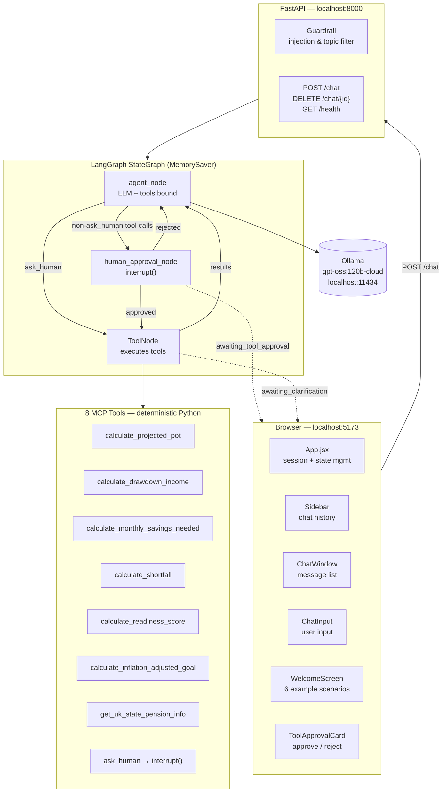
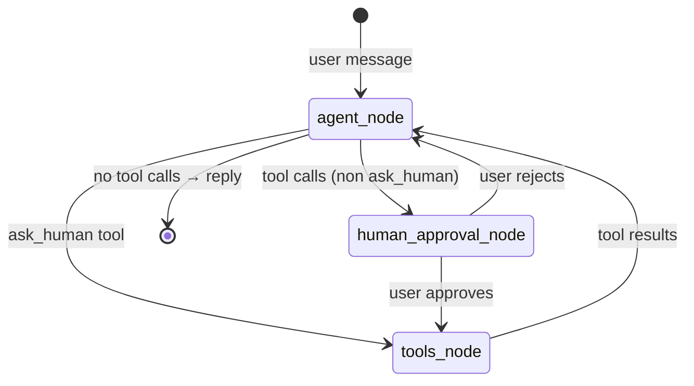
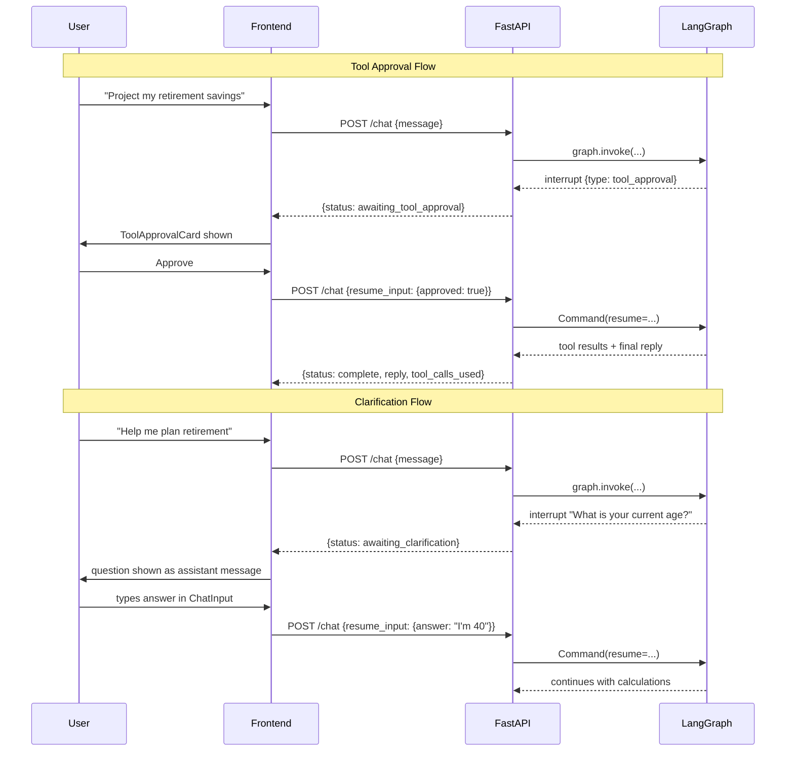

# Wealth Advisor

A conversational UK wealth advisor powered by a local LLM (Ollama). Deterministic Python formulas handle all arithmetic — the AI decides _which_ tools to call and narrates the results in plain English.

## Features

- **Multi-turn conversation** — full chat history per session, persisted in localStorage
- **8 MCP-style financial tools** — retirement projections, drawdown income, monthly savings, shortfall, readiness score, inflation adjustment, UK state pension lookup, and mid-flow clarification
- **Human-in-the-loop (HIL)** — tool approval before execution + clarification questions shown inline in chat
- **Auto-approve toggle** — skip manual tool approval for demo / power-user flows
- **Dark / light mode** — user-toggled, persisted in localStorage
- **Session sidebar** — history grouped by Today / Yesterday / Earlier; click to restore, delete to clear
- **Guardrails** — prompt-injection detection, off-topic blocking, AI-output validation
- **Fully local** — no data leaves your machine; Ollama runs on the host

---

## Architecture



---

## Agent state machine



---

## Human-in-the-loop sequence



---

## Project structure

```
wealth-advisor/
├── docker-compose.yml
├── .env.example
├── README.md
│
├── backend/
│   ├── Dockerfile
│   ├── pyproject.toml
│   └── app/
│       ├── main.py          ← FastAPI app + CORS
│       ├── router.py        ← HTTP routes + guardrail functions
│       ├── config.py        ← pydantic-settings (OLLAMA_BASE_URL, OLLAMA_MODEL)
│       ├── models.py        ← all HTTP Pydantic models
│       ├── llm.py           ← LLM client factory (ChatOllama)
│       ├── data/
│       │   └── prompts.json ← system prompt
│       └── agent/
│           ├── __init__.py  ← re-exports `graph`
│           ├── tools.py     ← 8 @tool functions + I/O models
│           ├── nodes.py     ← agent_node, human_approval_node, routing, state
│           └── graph.py     ← StateGraph construction + MemorySaver compilation
│
└── frontend/
    ├── Dockerfile
    ├── package.json
    └── src/
        ├── main.jsx
        ├── App.jsx          ← root component, session management
        ├── index.css
        ├── api/
        │   └── chat.ts      ← sendMessage, resumeInterrupt, clearChat
        ├── types/
        │   └── chat.ts      ← TypeScript interfaces mirroring Pydantic models
        ├── context/
        │   └── ThemeContext.jsx
        └── components/
            ├── chat/        ← message rendering + interaction
            │   ├── ChatInput.jsx
            │   ├── ChatWindow.jsx
            │   ├── FormattedMessage.jsx
            │   ├── MessageBubble.jsx
            │   ├── ToolApprovalCard.jsx
            │   ├── ToolCallBadge.jsx
            │   └── ToolCallMessage.jsx
            ├── layout/
            │   └── Sidebar.jsx
            └── screens/
                └── WelcomeScreen.jsx
```

---

## Local development

**Prerequisites:** Ollama installed and the model pulled:
```bash
brew install ollama
ollama pull gpt-oss:120b-cloud
```

```bash
# Terminal 1 — Ollama (always on Mac host)
ollama serve

# Terminal 2 — Backend
cd backend
uv sync
uv run uvicorn app.main:app --reload
# → http://localhost:8000

# Terminal 3 — Frontend
cd frontend
npm install
npm run dev
# → http://localhost:5173
```

### Environment variables

Copy `.env.example` → `backend/.env` and adjust if needed:
```
OLLAMA_BASE_URL=http://localhost:11434
OLLAMA_MODEL=gpt-oss:120b-cloud
```

---

## Docker

```bash
docker compose up --build
```

| Service  | Port | Notes |
|----------|------|-------|
| frontend | 5173 | Vite dev server + HMR via volume mount |
| backend  | 8000 | FastAPI + Uvicorn |

Ollama runs on the **host** Mac and is reachable inside Docker at `host.docker.internal:11434`.

---

## API reference

| Method | Path | Description |
|--------|------|-------------|
| `GET` | `/health` | Returns `{status: "ok", model: "..."}` |
| `POST` | `/chat` | Send a message or resume an interrupt |
| `DELETE` | `/chat/{session_id}` | Signal to clear session (client generates new ID) |

### POST /chat

```json
{
  "session_id": "session-abc123",
  "message": "I'm 35, earn £60k, have £20k saved. Retire at 65?",
  "resume_input": null,
  "auto_approve_tools": false
}
```

Resume after tool approval: `{ "resume_input": { "approved": true } }`  
Resume after clarification: `{ "resume_input": { "answer": "I'm 40 years old" } }`

---

## Financial tool formulas

| Tool | Formula |
|------|---------|
| `calculate_projected_pot` | `FV = PV·(1+r)ⁿ + PMT·((1+r)ⁿ−1)/r` |
| `calculate_drawdown_income` | `income = pot·rate + state_pension` |
| `calculate_monthly_savings_needed` | `PMT = (target − PV·(1+r)ⁿ)·r / ((1+r)ⁿ−1) / 12` |
| `calculate_shortfall` | `shortfall = max(0, goal − projected)` |
| `calculate_readiness_score` | `score = min(100, int(projected/goal·100))` |
| `calculate_inflation_adjusted_goal` | `adjusted = goal·(1+inflation)ⁿ` |
| `get_uk_state_pension_info` | Lookup: £11,502/yr from age 67 |
| `ask_human` | `interrupt(question)` — pauses the LangGraph execution |

The LLM **never** performs arithmetic. All numbers come from these Python functions.

---

## Tech stack

| Layer | Choice |
|-------|--------|
| Language | Python 3.12+ |
| Web framework | FastAPI |
| Agent orchestration | LangGraph with MemorySaver |
| LLM integration | langchain-ollama (native Ollama `/api/chat`) |
| Validation | Pydantic v2 — tools, nodes, state, HTTP layer |
| Package manager | uv |
| Frontend | React 18 + Vite 5 + Tailwind CSS v3 |
| LLM runtime | Ollama (local, no API key required) |
| Containers | Docker + Docker Compose |

---

> **Disclaimer:** This application is for demonstration purposes only and is **not** financial advice. Always consult a qualified financial adviser before making investment or pension decisions.
