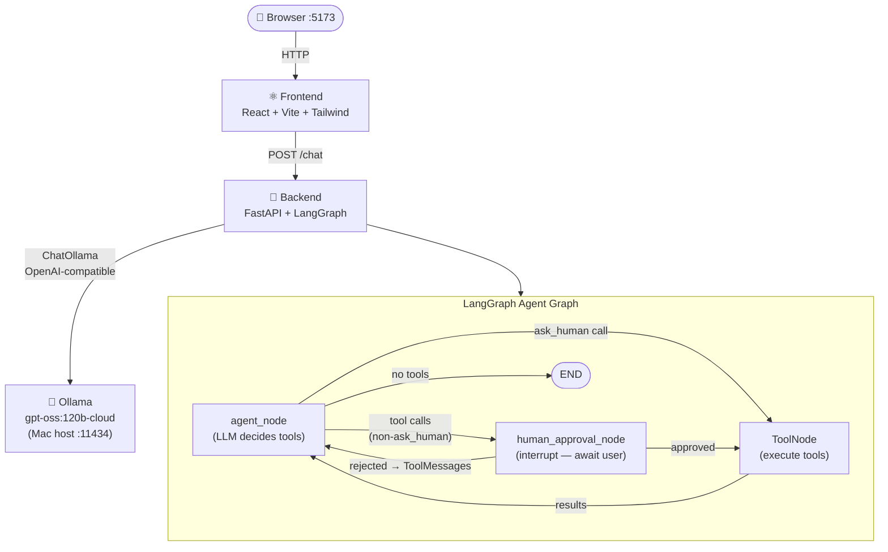

# Wealth Advisor

An Agentic chatbot for wealth and retirement planning. Have a natural conversation about your retirement goals, pension pot projections, savings targets, and income planning. The LLM runs entirely on your own Mac via Ollama — no API key or internet required.

## What it does

- **Conversational chat** — ask questions naturally, receive follow-up advice across multiple turns
- **Agentic tool selection** — the LLM automatically picks the right financial calculation tool for each question
- **Deterministic math** — all projections use hardcoded financial formulas (compound growth, drawdown, inflation), not AI guesswork
- **Human-in-the-loop** — before any calculation runs, you see the tool and its inputs and can approve or reject
- **Clarification flow** — when the AI needs missing data mid-conversation, it pauses and asks you

---

## Problem Statement

Retirement planning is complex, jargon-heavy, and deeply personal — yet most people have nowhere to turn for clear, scenario-specific guidance:

- Generic online calculators offer one-size-fits-all outputs with no room for follow-up questions
- Financial advisers are costly and inaccessible for the average saver
- Pension documentation is dense and difficult to interpret without domain expertise
- There is no accessible platform where individuals can ask retirement questions in plain language and receive personalised, calculated answers

---

## Solution

Wealth Advisor is an agentic AI chatbot built specifically for retirement and pension planning:

- Engages users in a natural, multi-turn conversation about their financial situation
- Automatically selects and runs the correct financial calculation tool based on the user's question
- Uses deterministic formulas — not AI estimation — for all projections (compound growth, drawdown, inflation adjustment)
- Pauses before executing any calculation so the user can review and approve the inputs
- Requests any missing information mid-conversation before proceeding

---

## Benefits

- **Conversational access** — ask retirement questions in plain English, with no financial jargon required
- **Personalised calculations** — projections are based on your specific numbers: age, savings, income goal, and retirement date
- **Transparency and control** — every tool call and its inputs are shown to you before execution; you approve or reject each one
- **Iterative planning** — refine your scenario across multiple turns without starting over

---

## Future Scope

- **Pension document comprehension** — upload and query pension scheme documents; the chatbot explains entitlements, rules, and projections in plain language
- **Deeper personalisation** — support for defined-benefit schemes, multiple pension pots, tax-relief modelling, and state pension forecasting
- **Scenario comparison** — model and compare multiple retirement strategies side-by-side in a single session
- **Regulated guidance integration** — structured signposting to FCA-regulated resources when advice thresholds are reached

---

## Architecture



### Service ports

| Service | Port | Description |
|---------|------|-------------|
| frontend | 5173 | React dev server (Vite) |
| backend | 8000 | FastAPI REST API |
| ollama | 11434 | LLM runtime on Mac host |

### MCP tools (pure Python math — no LLM in calculations)

| Tool | Formula |
|------|---------|
| `calculate_projected_pot` | `FV = PV*(1+r)^n + PMT*((1+r)^n-1)/r` |
| `calculate_drawdown_income` | `income = pot * drawdown_rate + state_pension` |
| `calculate_monthly_savings_needed` | Rearranged FV annuity for PMT |
| `calculate_shortfall` | `max(0, income_goal - projected_income)` |
| `calculate_readiness_score` | `min(100, projected/goal * 100)` → score + label |
| `calculate_inflation_adjusted_goal` | `FV = goal * (1 + inflation)^years` |
| `get_uk_state_pension_info` | £11,502/yr from age 67 lookup |
| `ask_human` | Triggers `interrupt()` to pause for clarification |

---

## Prerequisites

- [Docker Desktop](https://www.docker.com/products/docker-desktop/) installed and running
- Ollama installed on Mac:
  ```bash
  brew install ollama
  ```
- Model pulled:
  ```bash
  ollama pull gpt-oss:120b-cloud
  ```

---

## How to run (Docker)

```bash
# Step 1 — start Ollama on your Mac
ollama serve

# Step 2 — build and start all services
docker compose up --build

# Step 3 — open the app
open http://localhost:5173
```

---

## Local dev (no Docker)

```bash
# Tab 1 — Ollama
ollama serve

# Tab 2 — Backend
cd backend
uv sync
uv run uvicorn app.main:app --reload

# Tab 3 — Frontend
cd frontend
npm install
npm run dev
```

---

## Project structure

```
Wealth-Advisor/
├── docker-compose.yml
├── .env.example
├── README.md
│
├── backend/
│   ├── Dockerfile
│   ├── pyproject.toml
│   └── app/
│       ├── main.py          ← FastAPI app + CORS
│       ├── router.py        ← /health, /chat, DELETE /chat/{id}
│       ├── models.py        ← all Pydantic models (ChatRequest, ChatResponse, …)
│       ├── config.py        ← pydantic-settings (OLLAMA_BASE_URL, OLLAMA_MODEL)
│       ├── llm.py           ← ChatOllama client builder
│       ├── data/
│       │   └── prompts.json ← system prompt
│       └── agent/
│           ├── __init__.py  ← exports graph
│           ├── state.py     ← WealthAdvisorState (LangGraph state)
│           ├── tools.py     ← 8 MCP tools with Pydantic I/O models
│           ├── nodes.py     ← agent_node, human_approval_node, routing functions
│           └── graph.py     ← StateGraph assembly + compiled graph
│
└── frontend/
    ├── Dockerfile
    ├── package.json
    ├── vite.config.ts
    ├── tailwind.config.js
    ├── index.html
    └── src/
        ├── main.jsx
        ├── App.jsx          ← root component + session management
        ├── index.css
        ├── api/
        │   └── chat.ts      ← sendMessage, resumeInterrupt, clearChat
        ├── types/
        │   └── chat.ts      ← TypeScript interfaces mirroring Pydantic models
        ├── context/
        │   └── ThemeContext.jsx
        └── components/
            ├── chat/        ← UI shell components
            │   ├── ChatWindow.jsx
            │   ├── ChatInput.jsx
            │   ├── MessageBubble.jsx
            │   ├── FormattedMessage.jsx
            │   ├── WelcomeScreen.jsx
            │   ├── Sidebar.jsx
            │   └── LoadingSpinner.jsx
            └── tools/       ← agent interaction components
                ├── ToolApprovalCard.jsx
                ├── ToolCallMessage.jsx
                ├── ToolCallBadge.jsx
                └── ClarificationCard.jsx
```

---

## API endpoints

| Method | Path | Description |
|--------|------|-------------|
| GET | `/health` | Health check + active model name |
| POST | `/chat` | Send a message or resume an interrupt |
| DELETE | `/chat/{session_id}` | Clear session (start fresh) |

### POST /chat — send a message

```json
{
  "session_id": "session-abc123",
  "message": "I'm 40, earn £70k, want to retire at 65 with £40k/yr"
}
```

### POST /chat — resume after tool-approval interrupt

```json
{ "session_id": "session-abc123", "resume_input": { "approved": true } }
```

### POST /chat — resume after clarification interrupt

```json
{ "session_id": "session-abc123", "resume_input": { "answer": "My pension pot is £30,000" } }
```

---

## Tech stack

| Layer | Choice |
|-------|--------|
| Language | Python 3.12+ |
| Web framework | FastAPI |
| Agent orchestration | LangGraph |
| LLM integration | langchain-ollama (OpenAI-compatible) |
| Validation | Pydantic v2 (tools, nodes, state, API) |
| Package manager | uv |
| Frontend | React 18 + Vite 5 + Tailwind CSS v3 |
| LLM runtime | Ollama (local, no API key) |
| Containers | Docker + Docker Compose |
