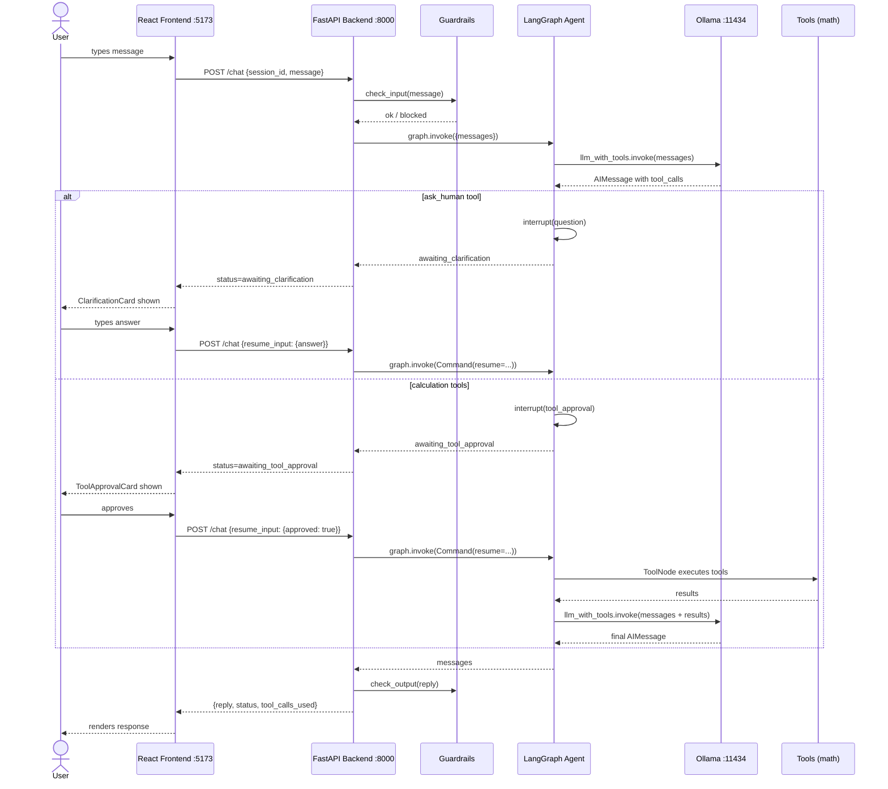

# Wealth Advisor

An AI-powered UK wealth and retirement planning chatbot. Ask questions naturally about pension pots, retirement income, savings targets, and inflation — the agent picks the right calculation tool, shows you what it's about to run, and waits for your approval before executing it. The LLM runs entirely on your Mac via Ollama — no API key or cloud dependency.

---

## What it does

- **Conversational planning** — multi-turn chat that remembers context across your session
- **Agentic tool selection** — the LLM decides which financial calculation to run based on your question
- **Deterministic math** — all projections use hardcoded financial formulas (compound growth, drawdown, inflation), never AI estimates
- **Human-in-the-loop approval** — before any calculation runs you see the tool and its inputs; you approve or reject
- **Clarification flow** — when the agent needs missing data it pauses and asks rather than guessing
- **Guardrails** — input and output safety checks block injection attempts, harmful content, and off-topic requests

---

## Architecture



---

## Tech stack

| Layer | Choice |
|---|---|
| Backend language | Python 3.12+ |
| Web framework | FastAPI |
| Agent orchestration | LangGraph |
| LLM integration | langchain-ollama (ChatOllama) |
| Validation | Pydantic v2 |
| Package manager | uv |
| Frontend | React 18 + Vite 5 + Tailwind CSS v3 |
| LLM runtime | Ollama (local, no API key needed) |
| Model | `gpt-oss:120b-cloud` |
| Containers | Docker + Docker Compose |

---

## Prerequisites

| Requirement | Notes |
|---|---|
| [Ollama](https://ollama.com) | Must be running on your Mac |
| `gpt-oss:120b-cloud` model | `ollama pull gpt-oss:120b-cloud` |
| Python 3.12+ | For local backend dev |
| [uv](https://github.com/astral-sh/uv) | `pip install uv` |
| Node.js 20+ | For local frontend dev |
| Docker Desktop | For Docker-based setup only |

---

## Quick start — Docker

```bash
# 1. Start Ollama on your Mac
ollama serve

# 2. Build and start all services
docker compose up --build

# 3. Open the app
open http://localhost:5173
```

---

## Quick start — Local

```bash
# Tab 1 — LLM runtime (always on Mac host)
ollama serve

# Tab 2 — Backend
cd backend
uv sync
uv run uvicorn app.main:app --reload
# API available at http://localhost:8000

# Tab 3 — Frontend
cd frontend
npm install
npm run dev
# App available at http://localhost:5173
```

---

## Project structure

```
Wealth-Advisor/
├── docker-compose.yml
├── .env.example
├── README.md
│
├── backend/
│   ├── Dockerfile
│   ├── pyproject.toml
│   └── app/
│       ├── main.py              FastAPI app, CORS, middleware
│       ├── session.py           WealthAdvisorState, MemorySaver, make_config()
│       ├── core/
│       │   ├── config.py        Pydantic settings (OLLAMA_BASE_URL, OLLAMA_MODEL)
│       │   ├── logger.py        Shared logger factory
│       │   └── middleware.py    HTTP request/response logging
│       ├── agent/
│       │   ├── __init__.py      Exports compiled graph
│       │   ├── graph.py         LangGraph StateGraph assembly
│       │   ├── nodes.py         agent_node, human_approval_node, routing functions
│       │   └── tools.py         8 financial calculation tools + ask_human
│       ├── router/
│       │   ├── router.py        /health, POST /chat, DELETE /chat/{id}
│       │   ├── models.py        ChatRequest, ChatResponse, ToolCallInfo, PendingInterrupt
│       │   └── guardrails.py    Input/output safety checks
│       └── data/
│           └── prompts.json     System prompt and guardrail response messages
│
└── frontend/
    ├── Dockerfile
    ├── package.json
    ├── vite.config.ts
    ├── tailwind.config.js
    ├── index.html
    └── src/
        ├── main.jsx
        ├── App.jsx
        ├── index.css
        ├── api/
        │   └── chat.ts          sendMessage, resumeInterrupt, clearChat
        ├── types/
        │   └── chat.ts          TypeScript interfaces mirroring Pydantic models
        ├── context/
        │   └── ThemeContext.jsx  Dark/light mode context
        ├── layouts/
        │   └── AppLayout.jsx    Sidebar + main content shell
        ├── pages/
        │   └── ChatPage.jsx     Session management and chat logic
        └── components/
            ├── chat/
            │   ├── ChatWindow.jsx        Message list container
            │   ├── ChatInput.jsx         Textarea and send button
            │   ├── MessageBubble.jsx     User/assistant message display
            │   ├── FormattedMessage.jsx  Markdown and special block rendering
            │   ├── ToolCallMessage.jsx   Executed tools display
            │   ├── ToolApprovalCard.jsx  Tool approval UI
            │   ├── ClarificationCard.jsx Clarification question input
            │   └── WelcomeScreen.jsx     Landing screen with example scenarios
            ├── navigation/
            │   └── Sidebar.jsx          Session list and new chat button
            └── shared/
                ├── LoadingSpinner.jsx   Loading indicator
                └── ToolCallBadge.jsx    Small tool name badge
```

---

## API endpoints

| Method | Path | Description |
|---|---|---|
| `GET` | `/health` | Returns `{"status": "ok", "model": "..."}` |
| `POST` | `/chat` | Send a message or resume an interrupt |
| `DELETE` | `/chat/{session_id}` | Signals a session reset (frontend generates a new session ID) |

See [backend/README.md](backend/README.md) for full request/response schemas and tool reference.

---

## Financial tools

| Tool | What it calculates |
|---|---|
| `calculate_projected_pot` | Future pension pot value using compound growth annuity formula |
| `calculate_drawdown_income` | Annual retirement income from pot via sustainable drawdown |
| `calculate_monthly_savings_needed` | Monthly savings required to hit a target pot |
| `calculate_shortfall` | Annual income gap (or surplus) versus retirement goal |
| `calculate_readiness_score` | 0–100 readiness score with label (On track / Needs attention / At risk) |
| `calculate_inflation_adjusted_goal` | Inflates today's income goal to future money |
| `get_uk_state_pension_info` | UK state pension amount (£11,502/yr) and eligibility from age 67 |
| `ask_human` | Pauses the workflow to ask the user a clarifying question |
